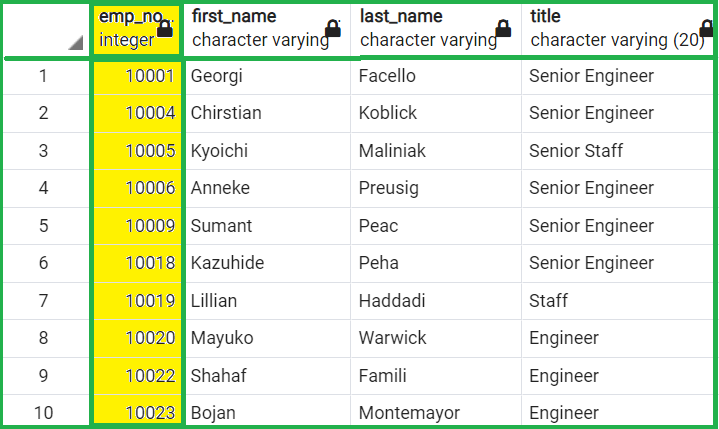
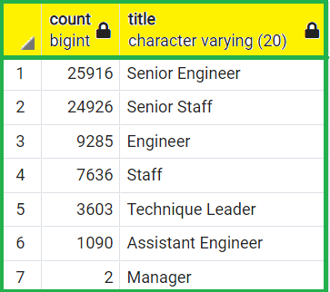
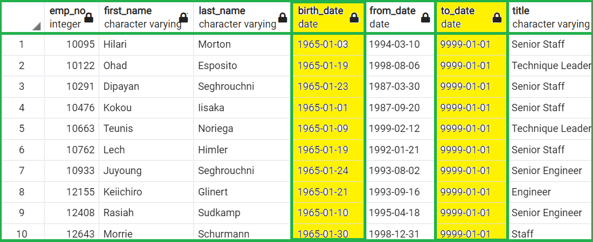
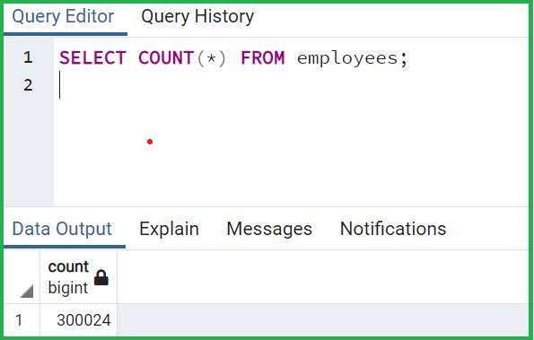
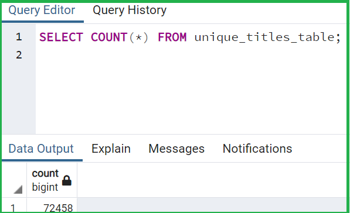
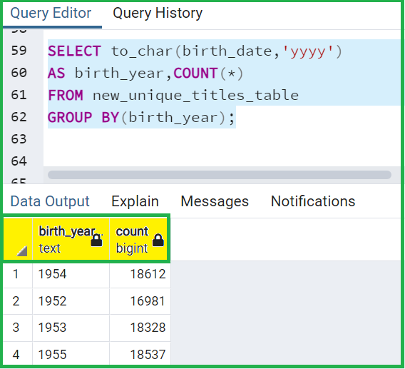
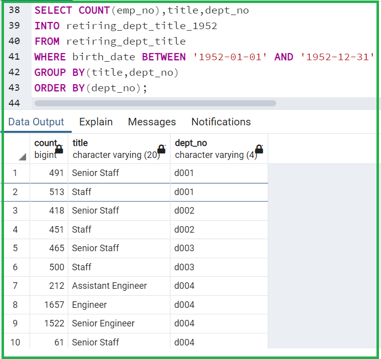
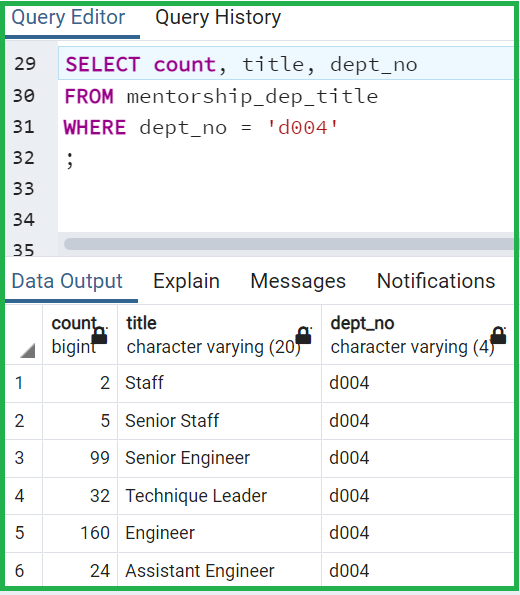
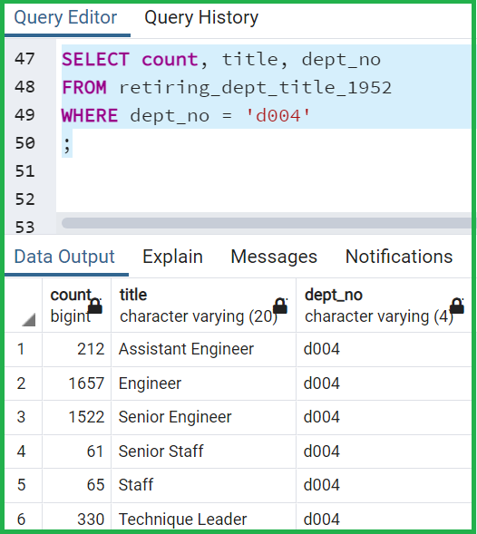

# Pewlett-Hackard-Analysis

## Overview of the project

In this project, we were working on a employee data-set using SQL. Structured Query Language (SQL), is a standardized
programming language for storing, manipulating and retrieving data stored in a relational database. SQL is capable
of handling large number of transactions in a single query and it is easier to manage a relational database using SQL as
no large amount of coding is required. 

### Purpose

The main purpose of this project was to analyze the employees' data to determine the number of employees who are going
to retire per title and also to identify employees who are eligible to participate in a mentorship program. This data will
help the company to get the details of the positions which need to be filled in near future and also help them to scope the
number of employees available to participate in the employee mentorship program.

## Analysis and results 

To determine the number of employees retiring per title and employees who are eligible to participate in a
mentorship program we have used the following steps:

### Creation of retiring employee table:

- Firstly, we used `employees` and `titles` table to determine the number of retiring employees by title, who were born
between 1952 and 1955. Although this provided us a list of employees who were going to retire soon, but it was not providing
the correct data. There were duplicate entries for some employees because they had switched titles via promotion over the
years.

- In order to get the unique title for each employee, DISTINCT ON() function was applied on the employee number. Also,
`to date` was set equal to `9999-01-01`, so that the most recent title of each employee can be determined. By this query,
we were able to get the details with the most recent title of each employee, without any repetition. However, it
is observed that we really did not need to use DISTINCT ON() function in our query as the `to date` filter was
enough to remove employees with multiple rows due to different titles.

- To get the total number of retiring employees for each title, COUNT() function was applied on employee number along
with GROUP BY() function on title. By this query, we were able to create a table, which was holding the count of retiring
employees for each title. Alternatively, this data can help us to determine how many positions are needed to be filled
in future for each title.

### Creation of mentorship eligibility table: 

- In order to determine the mentorship eligibility, we have used the following logical steps:

1. `Employees`, `dept_emp` and `titles` tables were joined to get the required details.
2. DISTINCT ON() function was applied on emp no to get the unique employee data.
3. To date was set equal to `9999-01-01` to get the current employees who were born in `1965`.

Based on the data above, we have observed the following: 

1. Total number of retiring employees are `72458`, which are almost `25%` of the total number of employees `(300024)`.

2. Total number of employees eligible for mentorship program are `1549`, which are about `2%` of the total number of
employees retiring `(72498)`. We have compared the number of employees eligible for mentorship to number of retiring
employees as the number of retiring employees are a reflector of how many new employees are going to join the
organization who will require mentorship.

## Summary

1. Total `72458` roles will need to be filled as the **"silver tsunami"** begins to make an impact. To get the more precise
results, we have made another table where we have extracted the retiring employees per birth year. From this table,
we can query and find out the total number roles need to be filled each year.

2. Total number of employees eligible for mentorship program are `1549` whereas, `72498` employees are retiring over the four
years. It seems we do not have sufficient mentors for the next generation of employees. We have made an assumption regarding
the analysis:
- Mentor and mentee should be from same department and title. 

Considering above assumptions, we have written additional queries to dig into more insights wherein, we have extracted
the department-wise retiring employee data with title and department-wise mentorship eligible employee data with title.
This data can be more useful in understanding the ratio between mentor and mentee.

In our analysis, we have utilized the data of retiring employees who were born in year `1952`, assuming that they are
going to retire in first year. After analyzing the data, we have noticed that `16981` employees are retiring whose
birth year is `1952` whereas, the mentorship eligible employees are `1549`, which are about 10% of the employees retiring
with birth year `1952`. 

For example, if we analyze the data for dept `d004` for retiring employees and mentorship eligible employees, we can see
that there are only `2 staff` eligible for mentorship against `65 retiring staff`. Also, there are only `99 senior engineer`
eligible for mentorship against `1522 retiring senior engineer`, which do not look sufficient to provide mentorship
to new generation employees.

 

